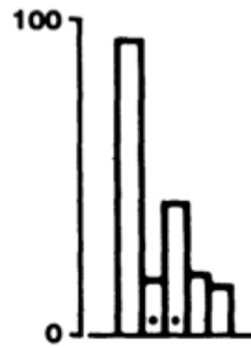
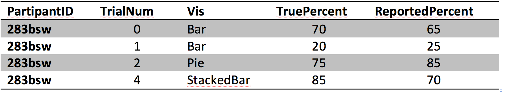
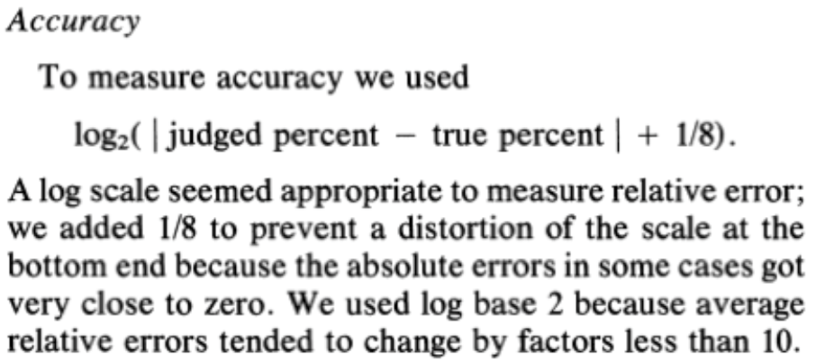
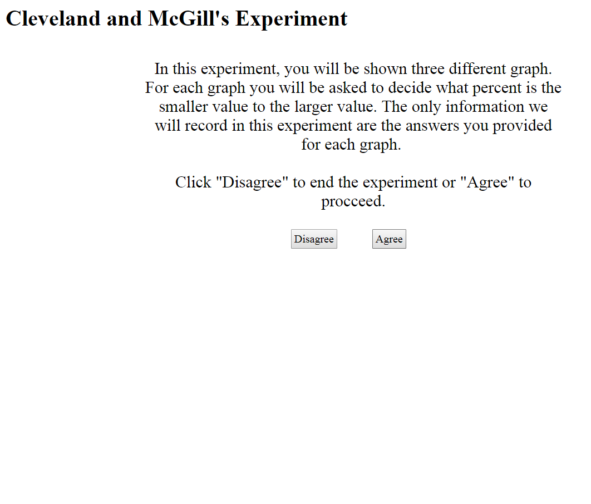
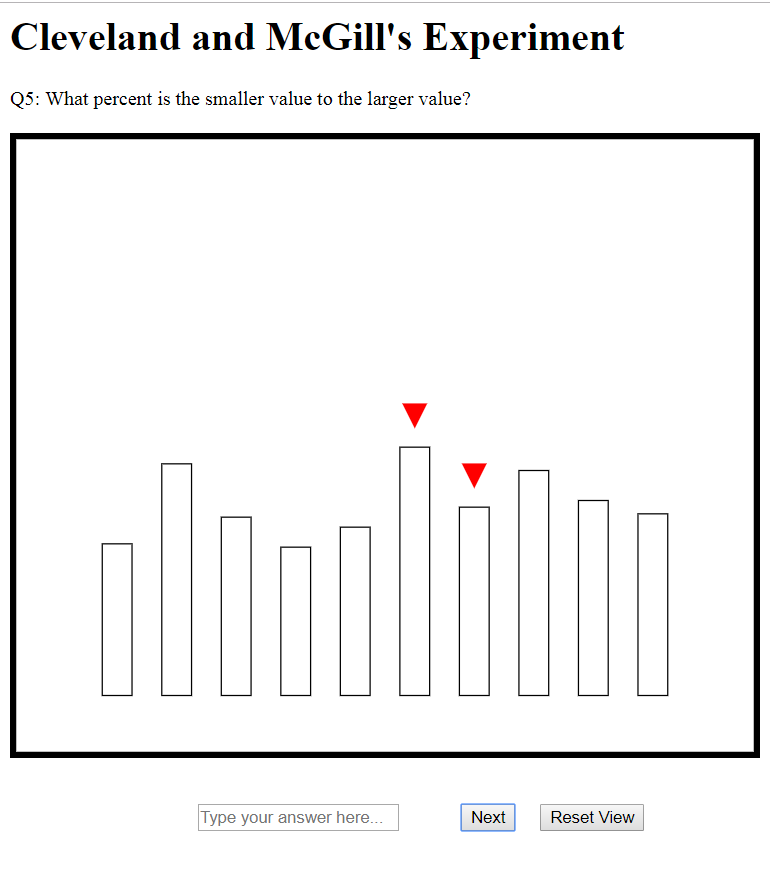
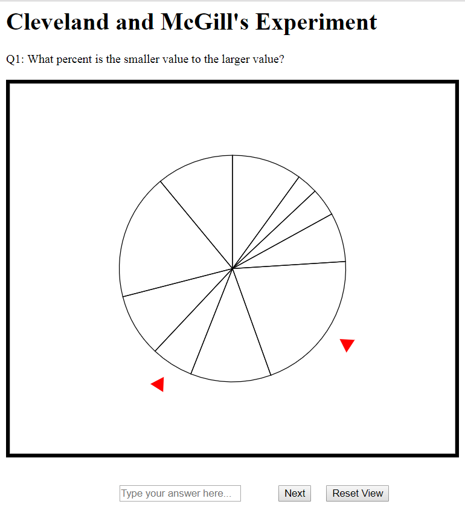
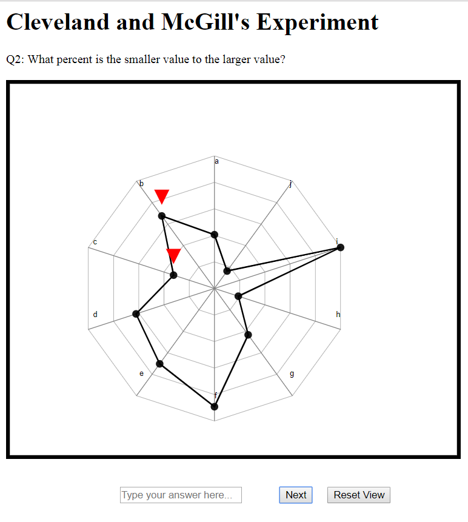
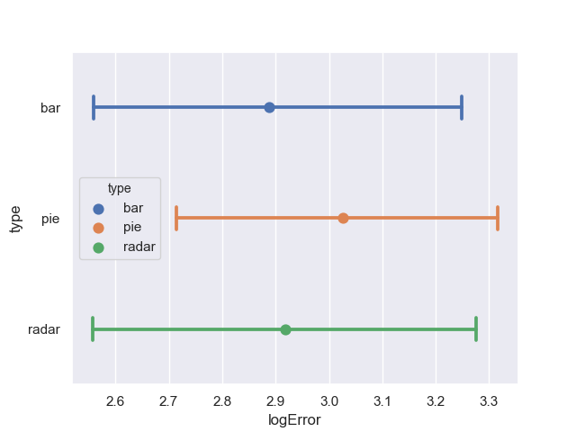
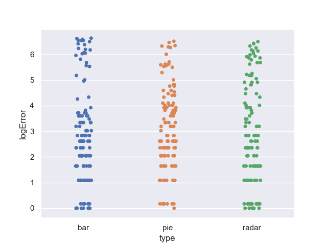

  Team Members
---
Kien Nhan  
Jimmy Tran  
Akash Shaji

Startup Server instructions
---

source `server/bin/activate` then 'python3 server/app.py' to start the server

`deactivate` to stop the server

If your building this locally you will have to update the post request in `/server/templates/index.html` in the SubmitData function

Github Page Link
---

We hosted the experiment on our own server, so the live link is currently down. A copy of the website we used is hosted on gh-pages [here](https://kvnhan.github.io/03-Experiment/), but since the server is no longer up nothing will be saved.

Background
---

In 1984, William Cleveland and Robert McGill published the results of several controlled experiments that pitted bar charts against pies and stacked-bar variants. 
Their paper (http://www.cs.ubc.ca/~tmm/courses/cpsc533c-04-spr/readings/cleveland.pdf) (http://info.slis.indiana.edu/~katy/S637-S11/cleveland84.pdf) is considered a seminal paper in data visualization.
In particular, they ran a psychology-style experiment where users were shown a series of randomly-generated charts with two graphical elements marked like this:

Participants were then asked, "What percentage is the smaller of the larger?". 
This was repeated hundreds of time with varying data and charts. 
By the end of the study, Cleveland and McGill had amassed a large dataset that looked like this:

__Log-base-2 or "cm-error"__: The true percent is the actual percentage of the smaller to the larger, while the reported percent is what participants reported. 
Cleveland and McGill recognized that their analyses would be biased if they took `abs(ReportedPercent – TruePercent)` as their score for error. 
To compensate, they came up with a logarithmic scale for error with this equation:

You’ll be implementing this error score as part of the lab. 
(Hint: it’s not a trick question, this is just to familiarize you with the experiment protocol). 
With this Cleveland-McGill error score you can better compare the performance of the charts you test to figure out which one performs the best.

As a baseline, compare your average Error scores to the following chart, which include both Cleveland and McGill’s results as well as more recent extensions of this experiment (lower error indicates better performance, and error bars are bootstrapped 95% confidence intervals (`http://en.wikipedia.org/wiki/Confidence_interval#Meaning_and_interpretation`)):

Experiment
---
For our version of the experiment, we used bar charts, pie charts, and a radar charts, each uses 10 data points. We randomize the data points with a min > 6 and max < 78 in which all points add up to 200. We wanted to see how well people can figure out the percentage of the smaller value to the bigger value using the three different charts.

We generated the data by creating five sets of random values distributing them to each of the three chart types and then shuffling everything. This way, each data set is tested three times by each chart type, resulting in less potential bias. 

- Introduction

To start the experiment, we have an introduction page to tell the participants what we are doing and what their role is. We assured that their personal information will not be recorded in any way, only the answer they provide. We have two options, disagree and agree. Disagree will end the experiment while agree will allow them to proceed with the experiment.

- Bar Chart
  

For our Bar Chart presentation, we have a standard bar chart with spaces in between each bar. The bars are not color and each bar has the same stroke color and stroke size. 

- Pie Chart

For our Pie Chart presentation, we have a standard pie chart without any color or any other special modification to it. Each slice has different size and the entire pie chart has the same stroke size.

- Radar Chart

Radar is an unorthodox method to use for our experiment, but we wanted to try it. Here we have 10 data points individually plot to the respective axis on the chart. The comparison here is not the shape but the values of the chosen points. 

Results
---

We decided to test effectiveness of radar charts (which don't have much data on them) against the effectiveness of pie and bar charts, which a lot of data from various studies). Overall we found that bar charts were the best, radar charts were in the middle and that pie charts were the worse. 

- Error Bar

This Error bar shows the average error for each of the three charts and the bootstrap confidence interval for each error average. The average error for the three chart is very close to each other. Compare to the Cleveland-McGill's, our average for bar chart is higher by about 1.4. Compare to the Crowdsourced Results our average for pie chart is higher by about 1. 

- Strip Plot

This is a strip plot of all the log base 2 error data for all chart. For bar chart, most of the data point clusters around 3. Pie chart and radar chart data points are somewhat evenly spaced while bar bar has very little data from 4-5. 

Technical Achievement
---
- Server was hosted using a flask server, which made deploying it to our participants significantly easier.
- Saved participant responses anonymously on said server, which made it so we didn’t have to copy paste many JSON files.
- Made red arrow indicators…..
- Zoom/Pan
- Reset Button
- Displayed whether or not user was correct at the end

Design Achievement
---

- For our design achievements, red arrow indicators were added to show the user which two parts of the graph was being compared. These arrows would move up and down in order to catch the attention of the users and provide an aesthetic using animation. However, in order to not draw too much attention away from the actual graph, the arrows were smaller and only moves a moderate amount.

- The graphs are contained within a box so that the user knows the boundaries of the viewing area. 

- To help ensure that answers are given numerically and not to pollute our data with alphabet characters, an input check was implemented to ensure only numerical inputs are accepted, otherwise an alert will appear on the screen telling the user that only numbers are allowed.

- Users can zoom and pan the graph to their liking in order to have different views of the graph to compare. This allows them the freedom to get as close of a comparison as they can without necessarily giving them the ability to figure out the answer.

- In order to make our reset feature seem more fluid, an animation will play re-scaling and moving the graph back to their default attributes along with the arrows. This will ensure a sense of immersion through solidarity and level transformation. This works well when the user decides to be funny and finds out they can no longer view the graph due to excessive panning or zooming into the wrong areas.

- The table at the end are for users to see their own reported percentages compared to the actual percentages of the questions. The table also reports whether or not the user is correct by checking their answers within a +/-2 range of actual percentage. The color of the “Correct” and “Incorrect” words are colored green and red respectively in order for the user to more easily identify which ones that were wrong.

References
---
- Radar Chart : https://rawgit.com/tpreusse/radar-chart-d3/master/src/radar-chart.js

